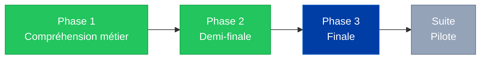
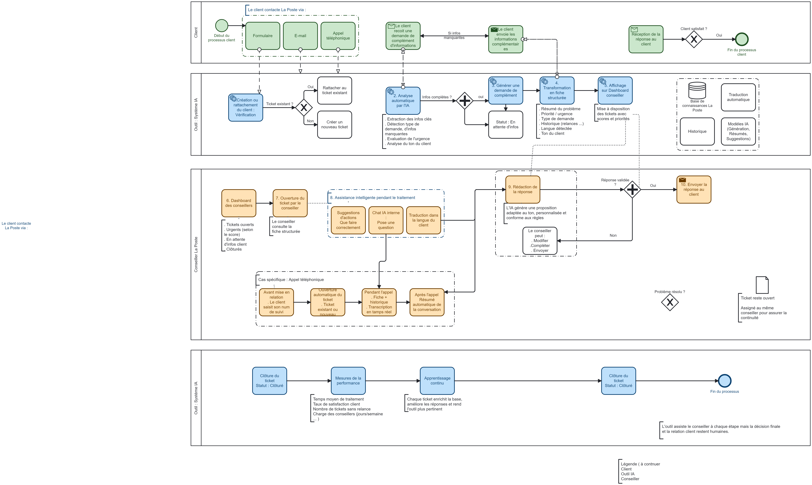
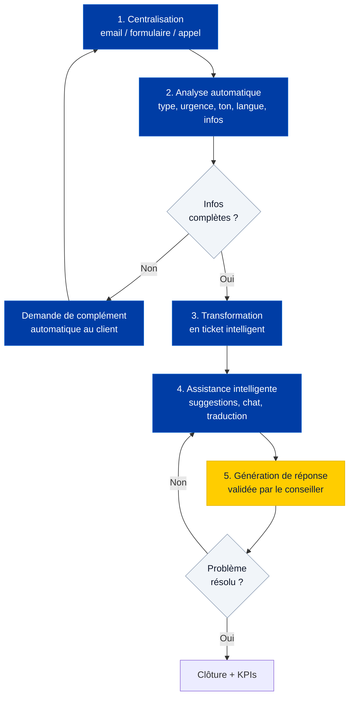
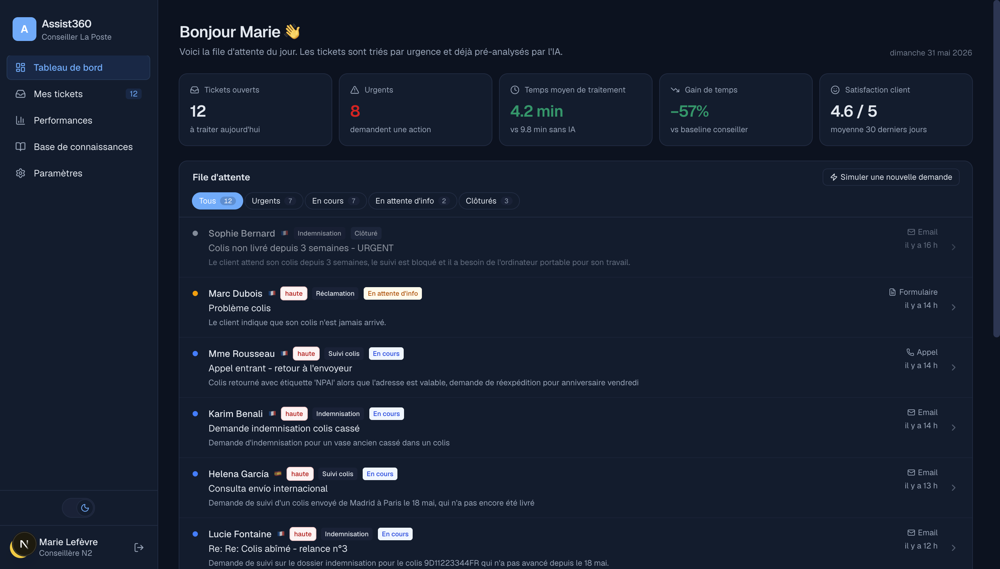
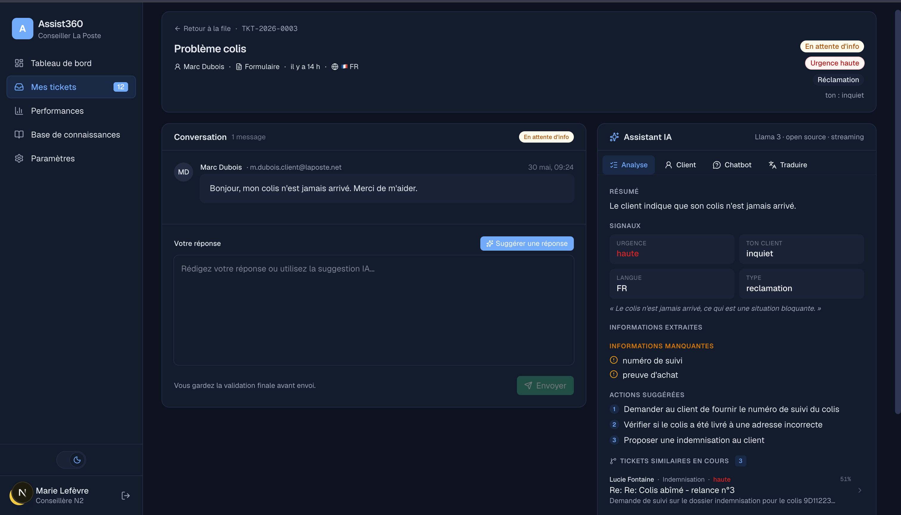
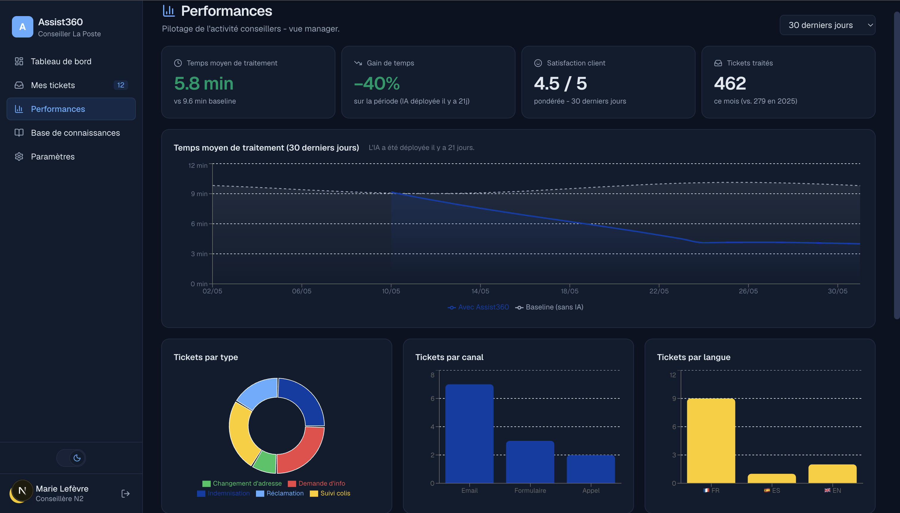

<div align="center">

# Assist360

**Plateforme d'assistance IA pour les conseillers clientèle de La Poste.**

L'IA qui assiste, pas qui remplace. Human-in-the-Loop par construction.

[](https://www.womeningenai.fr/)
[]()
[](LICENSE)
[]()

</div>

---

## Sommaire

1. [Contexte et enjeux](#contexte-et-enjeux)
2. [Étude de l'existant](#étude-de-lexistant)
3. [Démarche du projet](#démarche-du-projet)
4. [Processus métier (BPMN)](#processus-métier-bpmn)
5. [La solution Assist360](#la-solution-assist360)
6. [Architecture fonctionnelle](#architecture-fonctionnelle)
7. [Captures d'écran](#captures-décran)
8. [Fonctionnalités](#fonctionnalités)
9. [KPIs et impacts](#kpis-et-impacts)
10. [Avantages et bénéfices](#avantages-et-bénéfices)
11. [Stack technique](#stack-technique)
12. [Lancer en local](#lancer-le-prototype-en-local)
13. [Architecture du code](#architecture-du-code)
14. [Choix d'implémentation](#choix-dimplémentation-notables)
15. [Sécurité](#sécurité)
16. [Roadmap](#roadmap-post-hackathon)
17. [Équipe AIThena](#équipe-aithena)

---

## Contexte et enjeux

Aujourd'hui, les conseillers clientèle de La Poste doivent gérer un volume important de sollicitations provenant de plusieurs canaux : formulaire web, email, appel téléphonique. En 2025, plus de **43 %** des réclamations clients étaient encore traitées par téléphone, contre **31 %** via le web, illustrant la forte pression exercée sur les équipes support.

Les demandes sont souvent hétérogènes et nécessitent :

- une **compréhension rapide** du besoin client,
- une **recherche d'informations** dans plusieurs outils,
- une **rédaction de réponses adaptées** au contexte et au ton du client.

Cette complexité est renforcée par les volumes massifs traités par La Poste, avec **plus de 2,7 milliards de colis** gérés en 2025.

Conséquence directe : charge cognitive élevée, délais de traitement qui s'allongent, fatigue opérationnelle croissante pour les conseillers.

Le projet vise à améliorer **simultanément** :

- l'**expérience client** (réponses plus rapides, plus précises, multilingues),
- la **productivité des conseillers** (automatisation des tâches répétitives),
- la **qualité de vie au travail** (réduction de la charge cognitive, assistance temps réel).

La solution repose sur une approche **Human-in-the-Loop** où l'IA accompagne les conseillers tout en laissant la validation finale aux équipes humaines.

---

## Étude de l'existant

La Poste dispose déjà de plusieurs outils pour accompagner les conseillers. Mais certaines limites persistent.

| Existant actuel | Limites identifiées | Impact métier | Apport d'Assist360 |
|---|---|---|---|
| Charge opérationnelle et traitement manuel | Intervention forte, charge cognitive élevée | Lenteur, fatigue, erreurs possibles, surcharge | Automatisation et assistance au traitement |
| Manque d'intelligence du système | Pas de traduction temps réel, pas de priorisation, mauvaise orientation | Barrière linguistique, mauvaise gestion des urgences | Analyse, priorisation et traduction multilingue en temps réel |
| Fragmentation des outils et canaux (CRM, Teams, formulaires, modèles de réponse, chatbot interne) | Multiplication des outils, manque de centralisation | Perte de temps, rupture de fluidité, expérience conseiller complexe | Plateforme centralisant tous les canaux (emails, appels, formulaires) |

L'analyse met en évidence un besoin clair de **centralisation**, d'**automatisation** et d'**assistance intelligente** pour fluidifier le traitement des demandes et réduire la charge opérationnelle.

---

## Démarche du projet

Assist360 a été mené selon une approche **agile et itérative**, centrée sur la compréhension des besoins métier et la conception progressive d'une solution adaptée aux contraintes opérationnelles.



| Phase | Contenu |
|---|---|
| **1. Compréhension métier** | Interviews conseillers, analyse du BPMN existant, étude des outils en place |
| **2. Demi-finale** | Concept validé, premières maquettes, prompts d'analyse, livrable PPTX |
| **3. Finale** | Prototype fonctionnel bout-en-bout : RAG, streaming, multilingue, PII redaction, mode dark |
| **Suite** | Pilote sur un service support, mesure des KPIs réels, itération sur les prompts |

L'objectif : garantir une solution alignée avec les usages réels en combinant analyse métier, conception fonctionnelle et validation progressive.

---

## Processus métier (BPMN)

Le processus de traitement des demandes clients a été modélisé en BPMN afin de représenter clairement les étapes du flux de gestion, depuis la réception jusqu'à la clôture du ticket.



Le diagramme couvre quatre voies (swim lanes) :

1. **Client** : contact via formulaire / email / appel, réception éventuelle d'une demande de complément, validation finale de la réponse.
2. **Système IA - Vérification** : création ou rattachement du ticket, analyse automatique, génération de demande de complément si besoin, transformation en fiche structurée, affichage sur dashboard.
3. **Conseiller** : ouverture du ticket, assistance intelligente (suggestions, chatbot, traduction), rédaction et validation de la réponse, gestion spécifique des appels téléphoniques (résumé automatique post-appel).
4. **Système IA - Mesure** : clôture du ticket, mesure de performance (temps moyen, satisfaction, charge), apprentissage continu sur les messages modifiés par le conseiller.

Tous les chemins du diagramme sont implémentés dans le prototype, y compris la branche "infos manquantes -> demande de complément automatique" et le retour "problème non résolu -> ticket reste assigné au même conseiller".

---

## La solution Assist360

Assist360 s'appuie sur un ensemble de fonctionnalités intelligentes conçues pour centraliser les demandes, automatiser les tâches répétitives, et accompagner les conseillers en temps réel.

### Filtrage intelligent des demandes

Le système analyse automatiquement chaque demande pour :

- identifier les **informations clés** (numéros de colis, montants, dates, adresses),
- détecter les **éléments manquants** et vérifier la complétude des dossiers,
- générer si besoin une **demande de complément automatique** au client.

### Gestion intelligente des tickets

Chaque demande est convertie en un **ticket structuré** regroupant :

- résumé automatique en 1-2 phrases,
- niveau de priorité (haute / moyenne / basse),
- type de demande (réclamation, indemnisation, suivi colis, etc.),
- historique des échanges,
- contexte et infos extraites,
- langue détectée et ton du client.

### Assistance IA en temps réel

L'IA accompagne le conseiller pendant le traitement :

- **suggestion de réponse** contextualisée, avec choix du ton (empathique, concis, formel),
- **chatbot interne** basé sur la documentation La Poste (RAG avec embeddings multilingues),
- **traduction** automatique vers/depuis 4 langues européennes,
- **tickets similaires** détectés sémantiquement,
- **historique client** transverse avec tags VIP / fragile / escalade.

### Approche Human-in-the-Loop

Les suggestions générées par l'IA restent **systématiquement supervisées** par le conseiller, qui peut les compléter, modifier ou conserver telles quelles avant envoi. Cette approche garantit :

- un **traitement fiable** et conforme aux exigences métier,
- une **meilleure acceptation** de l'IA par les équipes,
- une **boucle d'amélioration continue** : les modifications du conseiller sont mesurées et alimentent les futurs prompts.

---

## Architecture fonctionnelle

Le fonctionnement d'Assist360 s'articule autour de **cinq grandes étapes** :



| Étape | Description |
|---|---|
| **1. Centralisation** | Les canaux (emails, formulaires, transcriptions d'appels) convergent vers une plateforme unique |
| **2. Analyse IA** | Extraction des infos clés, type de demande, urgence, ton client, langue, infos manquantes |
| **3. Ticket intelligent** | Fiche structurée : résumé, priorité, historique, statut, indicateurs contextuels |
| **4. Assistance intelligente** | Suggestions d'actions, chatbot interne, base documentaire, recommandations sur cas similaires |
| **5. Génération de réponse** | Proposition contextualisée, validée par le conseiller. Si non résolu, ticket reste assigné au même conseiller (continuité de la relation) |

---

## Captures d'écran

> Captures en mode sombre. Un toggle permet de basculer en clair à tout moment.

| Tableau de bord | Vue ticket détaillée | Performances (manager) |
|---|---|---|
|  |  |  |

---

## Fonctionnalités

### Pour le conseiller

- **File d'attente intelligente** triée par urgence, filtres par statut (en cours, en attente d'info, clôturés)
- **Analyse IA structurée** par ticket : résumé, type, urgence, ton, langue, infos manquantes, actions suggérées
- **Suggestion de réponse en streaming** (token par token) avec sélecteur de ton
- **Chatbot interne** appuyé sur une base documentaire (RAG avec embeddings multilingues)
- **Traduction automatique** EN / ES / DE / IT vers FR et inversement
- **Demande de complément** auto-rédigée quand l'IA détecte des infos manquantes
- **Fil de conversation** persisté, signé, horodaté
- **Onglet Client** avec historique transverse multi-tickets, tags VIP / fragile / escalade
- **Tickets similaires** détectés sémantiquement, pour éviter le travail en doublon
- **Résumé d'appel** automatique pour les transcriptions téléphoniques

### Pour le manager

- **Page Performances** avec KPIs (temps de traitement, gain vs baseline, satisfaction, volume)
- **Courbe temps de traitement** sur 7 / 30 / 90 jours
- **Répartition** par type, canal, langue
- **Charge par conseiller** avec alerte tickets urgents
- **Adoption IA** : % de suggestions validées telles quelles vs modifiées vs rédigées sans IA
- **Top questions** au chatbot interne pour identifier les gaps de documentation

### Conformité et UX

- **Redaction PII** avant tout appel LLM (numéros de colis, email, téléphone, montants, noms) avec restauration en sortie
- **Mode sombre / clair** avec persistence et respect des préférences système
- **Multilingue** auto-détecté (FR, EN, ES, DE, IT)
- **Login animé** + page de présentation publique de l'équipe

---

## KPIs et impacts

Les KPIs définis pour Assist360 mesurent objectivement l'efficacité du traitement et l'amélioration de la performance opérationnelle.

| KPI | Définition | Cible |
|---|---|---|
| **Temps moyen de traitement** | Durée moyenne entre réception et clôture d'un ticket | -30 à -50 % vs baseline (~10 min -> ~5 min) |
| **Taux de satisfaction client** | Score moyen pondéré sur les 30 derniers jours | ≥ 4,5 / 5 |
| **Tickets traités par conseiller** | Volume mensuel par membre d'équipe | x1,5 à x2 sans surcharge |
| **Adoption des suggestions IA** | % de suggestions IA validées telles quelles | > 70 % indique un bon alignement |
| **Répartition par type** | Distribution des demandes (réclamation, info, indemnisation, etc.) | Identifie les sujets récurrents à industrialiser |
| **Charge par conseiller** | Nombre de tickets ouverts par membre d'équipe | Permet d'équilibrer les ressources |

Le système de suivi distingue les tickets **en cours**, **résolus**, **en attente d'info** et **clôturés**.

Ces KPIs alimentent à la fois le pilotage opérationnel (manager) et la boucle d'amélioration continue (équipe produit / data).

---

## Avantages et bénéfices

Assist360 transforme concrètement le traitement des demandes en combinant automatisation, IA et assistance aux conseillers.

### Gain de temps et efficacité opérationnelle

La centralisation et l'automatisation de l'analyse permettent de **réduire fortement le temps de traitement**, avec un gain estimé entre **30 % et 50 %** sur le cycle de résolution.

### Réduction de la charge mentale

Les demandes sont automatiquement **analysées, résumées, priorisées**. Les conseillers disposent immédiatement des informations essentielles, ce qui réduit la complexité et la charge cognitive du traitement manuel.

### Amélioration de la qualité des réponses

L'assistance IA (chatbot interne, suggestions de réponses, traduction automatique) permet de produire des réponses **plus rapides, plus cohérentes, mieux adaptées au contexte client**, dans la langue du client.

### Amélioration de la performance globale

Le suivi en temps réel des KPIs permet une **meilleure gestion de l'activité** : répartition des tickets, réduction des délais, optimisation continue des processus, identification des gaps de documentation interne.

### Expérience client améliorée

Réponses plus rapides, multilingues, cohérentes : satisfaction client en hausse, réduction des relances et des escalades.

### Souveraineté et conformité

Modèle d'IA **open-source** (Llama 3, Meta), redaction PII systématique avant tout appel LLM, déploiement possible sur infrastructure interne La Poste ou cloud souverain européen.

---

## Stack technique

| Couche | Choix | Pourquoi |
|---|---|---|
| Frontend | Next.js 16 + React 19 + Tailwind 4 | App router, RSC, CSS variables pour le mode sombre |
| UI | shadcn-inspired, lucide-react, recharts | Léger, accessible, charts performants |
| Backend | FastAPI + Python 3.13 | Async natif, typage Pydantic, SSE simple |
| LLM | Llama 3 (open-source, Meta) via Groq | Latence très faible (~400 t/s), gratuit en dev, API OpenAI-compatible |
| RAG | fastembed (ONNX) + MiniLM multilingue + cosine | Pas de torch, multilingue, suffisant pour < 1000 chunks |
| Streaming | Server-Sent Events | Compatibilité large, simple à débugger |
| Persistence | JSON sur disque | Suffisant pour la démo, migration SQLite/Postgres prévue |
| Déploiement | Docker + docker-compose, cible Coolify auto-hébergé | Reproductible, déployable en 5 minutes |

La couche LLM est abstraite (`backend/llm.py`) : swap Groq / OpenAI / Ollama / Mistral en changeant `LLM_PROVIDER` dans `.env`, sans toucher au reste du code.

---

## Lancer le prototype en local

### Prérequis

- Python 3.11+
- Node.js 20+
- Une clé API Groq gratuite : [console.groq.com](https://console.groq.com)

### Backend

```bash
cd backend
python3 -m venv venv
source venv/bin/activate
pip install -r requirements.txt

cp .env.example .env
# Éditer .env et coller votre GROQ_API_KEY

python preload.py            # pré-analyse les 12 tickets de démo
python preload_incoming.py   # pool de tickets pour la simulation "live"

uvicorn main:app --reload --port 8000
```

Le premier démarrage télécharge le modèle d'embeddings (~220 Mo), ensuite c'est instantané.

### Frontend

```bash
cd frontend
npm install
npm run dev
```

Ouvrir [http://localhost:3000](http://localhost:3000).

Identifiants de démo pré-remplis : n'importe quel mot de passe fait l'affaire (authentification mockée).

### Avec Docker Compose

```bash
cp .env.example .env
# Éditer .env et coller GROQ_API_KEY

docker compose up --build
```

Pour le déploiement Coolify, voir [`DEPLOY.md`](DEPLOY.md).

---

## Architecture du code

```
backend/
  main.py             API FastAPI (routes /tickets, /chat, /suggest, /metrics, SSE)
  llm.py              Abstraction LLM (chat + chat_stream)
  rag.py              Index RAG sur la base de connaissances + index de tickets similaires
  pii.py              Redaction / restauration des PII
  prompts.py          Prompts système (analyse, suggest, chat, translate, request-info, call-summary)
  store.py            Accès données (tickets, KB, historique client)
  events.py           Bus d'événements in-process pour SSE
  preload.py          Pré-analyse des tickets de démo
  preload_incoming.py Pool de tickets pour la simulation "nouveau ticket en live"
  Dockerfile          Image Python prête pour Coolify
  data/
    tickets/          12 tickets démo (FR/EN/ES, email/appel/formulaire) + pool
    knowledge_base/   6 fiches métier La Poste (indemnisation, réexp., recommandé, ...)
    customers/        Historique transverse pré-écrit pour 4 clients

frontend/
  src/app/
    (auth)/login/     Écran de connexion animé
    (app)/            Pages protégées par session
      page.tsx                  Dashboard + KPIs + file d'attente
      tickets/[id]/             Vue détail conversation + assistant IA
      performances/             Pilotage manager avec graphiques
      base-de-connaissances/    Lecteur markdown des fiches
      parametres/               Profil + préférences IA
    equipe/           Page publique de présentation de l'équipe
  src/components/
    Sidebar / TicketList / TicketHeader / ConversationPanel
    AssistantPanel / CallSummaryCard / RequestInfoModal
    KpiRow / ThemeToggle
  src/lib/
    api.ts            Client API typé (REST + SSE)
    auth.ts           Session localStorage
    theme.ts          Toggle dark/light
    utils.ts          Helpers (cn, labels, formatters)
  Dockerfile          Image Next standalone prête pour Coolify

docker-compose.yml    Orchestration full-stack
DEPLOY.md             Guide Coolify pas-à-pas
DEMO_SCRIPT.md        Script de pitch 3-5 minutes
docs/bpmn-process.png Diagramme BPMN haute résolution
```

---

## Choix d'implémentation notables

- **Pré-analyse hors-ligne** : les 12 tickets de démo passent dans le pipeline d'analyse une seule fois, le dashboard charge donc instantanément.
- **Streaming SSE plutôt que WebSocket** : pas de bidirectionnel nécessaire, plus simple à débugger.
- **RAG par embeddings** sur la base de connaissances *et* sur les tickets ouverts (deux index distincts).
- **PII redaction par regex** plutôt que NER ML : déterministe, rapide, suffisant pour les catégories visées. NER serait plus robuste en prod.
- **Persistence JSON sur disque** : pour la démo c'est suffisant et permet de tout versionner. Migration Postgres prévue.
- **Pas d'auth réelle** : login mocké via localStorage. SSO La Poste serait la cible en prod.

---

## Sécurité

- La clé Groq est stockée dans `backend/.env` (gitignore). Ne jamais la commit.
- La **redaction PII** est activée par défaut (`PII_REDACT=true`). Les numéros de colis, emails, téléphones, montants et noms sont remplacés par des tokens neutres avant tout appel LLM, puis restaurés côté serveur dans la réponse.
- En production La Poste : modèle hébergé sur infrastructure interne ou cloud souverain, redaction PII conservée en défense en profondeur, audit log de chaque suggestion + décision conseiller.

---

## Roadmap post-hackathon

- [ ] Migration des données vers SQLite ou Postgres
- [ ] Auth SSO réelle
- [ ] Audit log structuré des suggestions IA et décisions conseiller
- [ ] Eval harness automatique sur les prompts (régression CI)
- [ ] Intégration vraie téléphonie (transcription temps réel)
- [ ] Connecteurs CRM La Poste
- [ ] Apprentissage continu à partir des messages modifiés par les conseillers
- [ ] Tests E2E Playwright + tests backend pytest
- [ ] Pilote sur un service support réel avec mesure des KPIs

---

## Équipe AIThena

Hackathon Women in GenAI 2026, demi-finale et finale.

| Membre | Rôle |
|---|---|
| Sarr Fatou | Product Lead |
| Membre 2 | Data Scientist |
| Membre 3 | ML Engineer |
| Membre 4 | Product Designer |

Présentation complète : [/equipe](http://localhost:3000/equipe) (page publique du prototype).

Code source : [github.com/EDOUARD745/Assist360](https://github.com/EDOUARD745/Assist360)

---

## Documentation interne

- [`DEMO_SCRIPT.md`](DEMO_SCRIPT.md) - script de démo 3-5 minutes pour le pitch
- [`DEPLOY.md`](DEPLOY.md) - déploiement Coolify pas-à-pas (Docker, env, domaines)
- [`docs/bpmn-process.png`](docs/bpmn-process.png) - diagramme BPMN haute résolution
- [`Documentation outil équipe AIThena.pdf`](Documentation%20outil%20%C3%A9quipe%20AIThena.pdf) - dossier complet demi-finale
- [`Livrable demi-finale AIThena.pptx`](Livrable%20demi-finale%20AIThena.pptx) - présentation demi-finale

---

## Licence

MIT - voir [`LICENSE`](LICENSE). Code librement réutilisable, attribution appréciée.

---

<div align="center">

Construit avec :yellow_heart: par l'équipe AIThena · Hackathon Women in GenAI 2026

</div>
